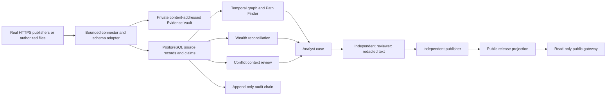

# Architecture

TRACE-PIA 0.4 extends the existing engineering core. Source systems remain authoritative for their own records. TRACE stores evidence and source assertions, proposes relationships and review signals, and never overwrites a government register.

## Runtime decisions

The practical graph implementation is **PostgreSQL adjacency tables**. It preserves transactional consistency between source records, evidence references, claims and relationships, requires one authoritative database, and supports bounded temporal BFS queries. Apache AGE would add a server extension and deployment burden without a demonstrated MVP need. Neo4j remains an optional, rebuildable projection for exploration; it is not the system of record and does not drive the API Path Finder. Projection rebuild is an administrative operation; PostgreSQL remains authoritative if projection refresh fails.

Every relationship retains subject/object direction, source observations, claims, valid-time bounds and observed/retrieved timestamps. Path search explores connectivity in either direction while returning original directions; it is not a causal inference. All edges must have a common validity interval. Missing dates produce temporal uncertainty rather than an invented date. Retracted claims and superseded edges are excluded; verified-only mode filters claim status. Budgets cap frontier size, queue growth, expansions and execution time; budget exhaustion is explicit rather than silent truncation.

## Ownership / systems of record

| Domain | Authoritative owner | TRACE responsibility |
|---|---|---|
| LEI and accounting parents | GLEIF publisher | Retain source bytes/record and extracted assertion; never relabel accounting parents as natural-person owners |
| Procurement / legal publications | TED, Find a Tender, Cellar | Store publication provenance, explicit award values and references; do not infer payment |
| Beneficial ownership | Register and its declared records; snapshot mapper separately identified | BODS 0.3/0.4 subset, identifier-based links, interval/range preservation and manual verification |
| Personal wealth | Authorized declaration/document issuer | Component provenance, completeness check and exact decimal bridge; no undocumented imputation |
| Investigations / release decisions | Installation's accountable reviewers | Versioned inputs, separate roles, auditable decisions, withdrawal and appeal |
| Evidence / audit | Installation operator and independent custodian | Private evidence bytes, integrity checks, audit checkpoints and recovery |

## Modules and guarantees

* Existing `canonicalize`, entity-resolution scoring, relationship intelligence and investigations remain available through protected `/api/v1` routes.
* `adapters` validates bounded OCDS/BODS and operator-mapped exports. Unknown persons, non-active awards and unsupported structures generate warnings or validation errors; no identity is guessed from name similarity.
* `pia_ingestion` uses an advisory transaction lock, stable payload identity and import batches. A successful replay reuses results. Failed database transactions leave no partial graph and record a separate failed attempt. Vault writes may precede rollback; unreferenced immutable objects can remain and require cautious retention management.
* `wealth` calculates a single-currency net-worth bridge using Decimal. Missing components return `INCOMPLETE`; an unexplained residual creates a review task, not an accusation.
* `pia_api` exposes evidence, claims, reviews, cases and public releases. Publication stores only reviewer-approved title/summary, not private graph rows, source bodies or internal case reasons.
* `audit` uses serialized database inserts and a linked SHA-256 chain. Database owners can bypass triggers; independent signed/off-host checkpoints are required against operator capture.
* `boundaries` authenticates both inherited and new internal routes, bounds request bodies, checks host/origin and adds security headers. New PIA domain mutations audit in the same transaction. Legacy writes have committed intent and completion records; completion audit failure is exposed by `X-Trace-Audit` and requires operator review.

## Implemented scope and remaining institutional work

This is a runnable reference application, not a certification. Institution-specific connectors/mappings, jurisdictional access control, OIDC federation/MFA, durable background jobs, signed off-site audit checkpoints, independent external key custody, large-scale graph/query planning, disaster-recovery drills and formal privacy/security review are deployment work. Redis and OpenSearch are optional infrastructure, not pretend worker/search implementations. Historical files claiming a broader architecture describe targets unless executable code and current validation prove them.

The 66-page Spanish v0.2 specification was not supplied. The architectural baseline is the existing GitHub core and the user's explicit requirements. A specification-to-code review must be completed when that document is available.

## Bitemporal reconstruction

See [TEMPORAL.md](TEMPORAL.md). Current tables are projections; immutable row versions and durable PostgreSQL commit receipts drive historical reads. Knowledge time is transaction COMMIT, independently of publisher/retrieval/fact dates. Graph, identity, claim/evidence, conflict, wealth and case reads accept a pinned `known_at`; old status and evidence are selected at that cutoff. Migration 009 creates an honest baseline and never invents pre-upgrade states.
